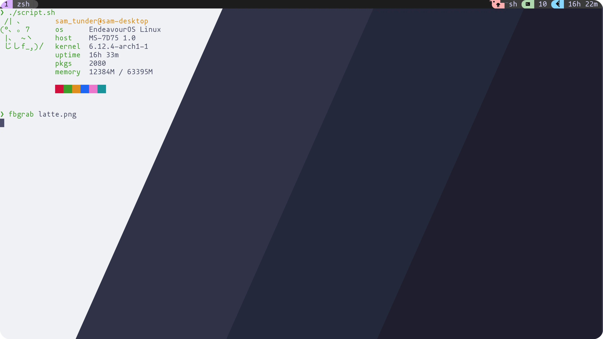
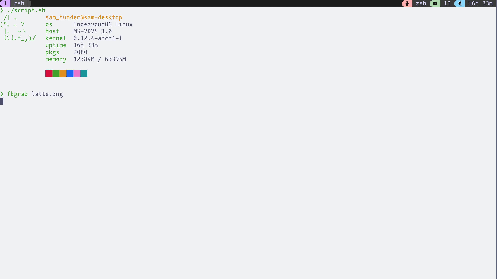
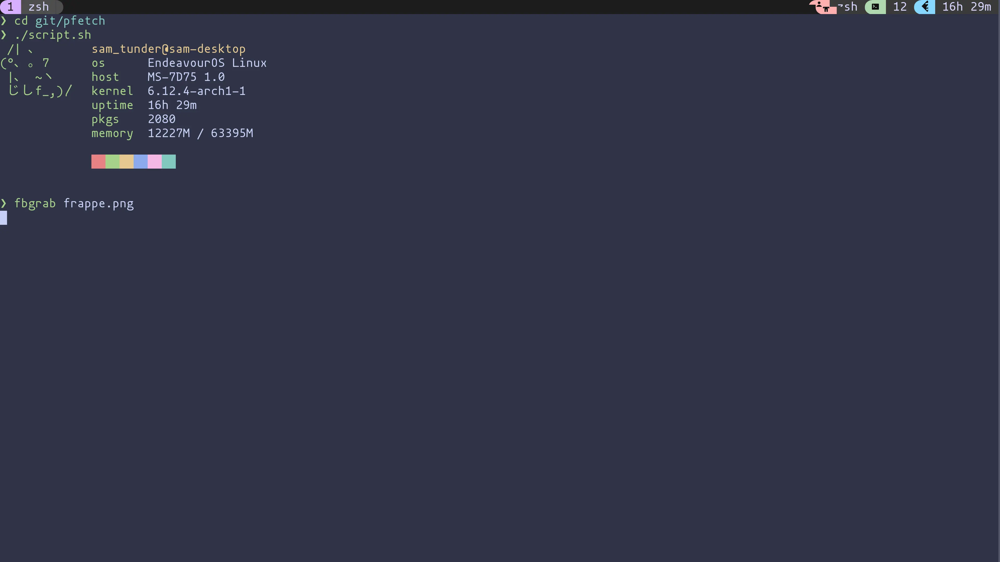
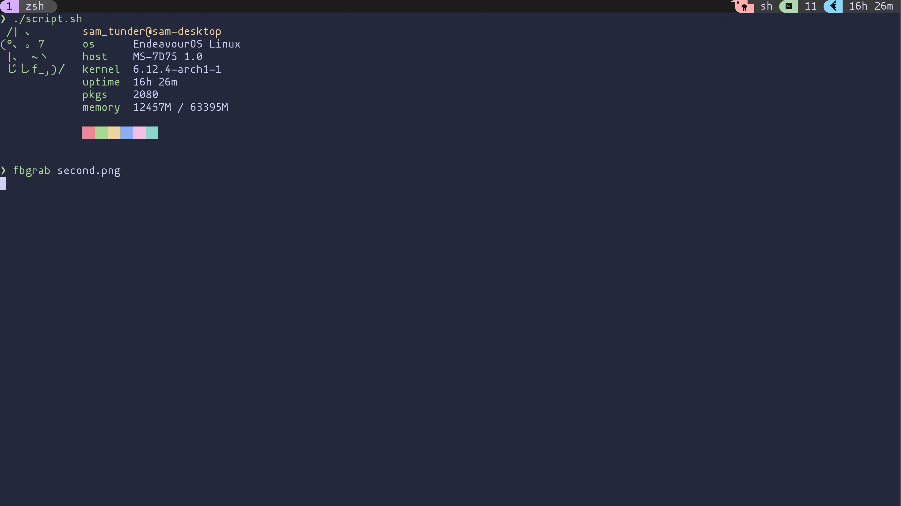
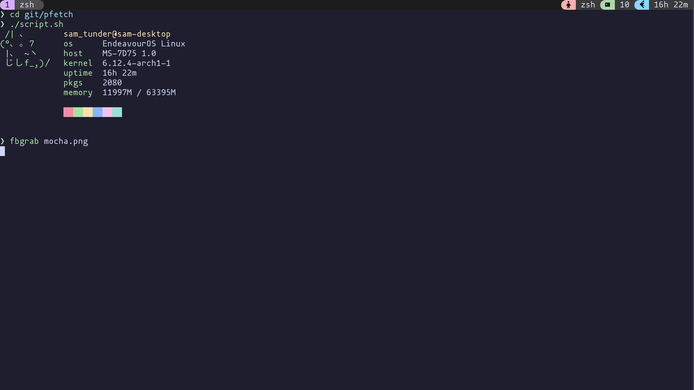

<h3 align="center">
	 
	
	Catppuccin for <a href="https://github.com/catppuccin/template">fbterm</a>
	
</h3>

	
	
	

	

## Previews

🌻 Latte

🪴 Frappé

🌺 Macchiato

🌿 Mocha

## Usage

1. Download the flavor .theme file of your choice.
2. Open fbtermrc in .config/fbterm/ and paste the contents of your flavor .theme file
3. start fbterm from tty and enjoy your pleasant catppuccin colorscheme

<!-- The FAQ section is optional. Remove if needed.-->
## 🙋 FAQ

- Q: **_"How can I do X?"_**\
  A: ...

## 💝 Thanks to

- [shadow_absorber](https://github.com/shadow-absorber)

&nbsp;

	

	Copyright &copy; 2021-present <a href="https://github.com/catppuccin" target="_blank">Catppuccin Org</a>

	

